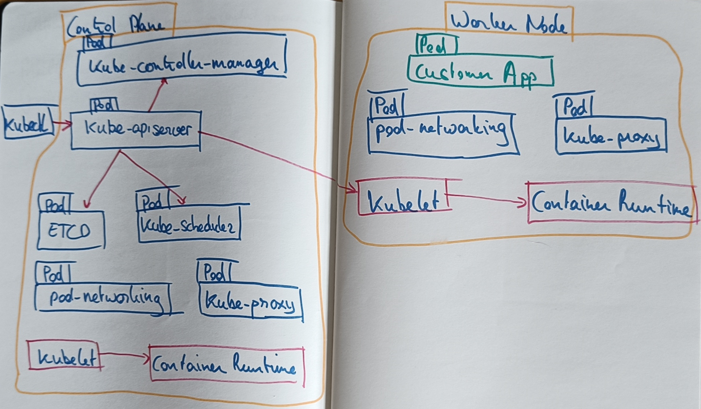

# Vagrant - Oracle Linux 8  - Kubernetes 
Vagrant project to install Kubernetes cluster on Oracle Linux 8
This project is based on [Certified Kubernetes Administrator (CKA) Course](https://github.com/kodekloudhub/certified-kubernetes-administrator-course).

## Settings
This Vagrant project is configurable through the [settings.yml](settings.yml). A description of the settings are in the next table.

| **Category** | **Sub-category** | **Attribute** | **Meaning** | **Example** |
| ------------ | ---------------- | ------------- | ----------- | ----------- |
| environment  | | vmsHome | Home of your VMs, to store the second disk | C:/Data/VirtualMachines/VirtualBox |
|              | | ipNetwork | Base of the Kubernetes/Hostonly network. The actual IP is created concatenate it with the node index + offset. | 192.168.56. |
| master/worker | | numOfNodes | Number of master or worker nodes. This project is not tested with multiple master nodes. | 1 |
|               | | ipStart    | Offset to determine the IP as a sum with the node index, concatenated to environment.ipNetwork. For instance 192.168.56.11. | 10
|               | | sshPortStart | Offset to determine the SSH NAT port for the node. | 2710 |
|               | | machine | Value of the _config.vm.define_ construct, concatenated with the index of the node. This is used in the Vagrant output. | kubemaster |
|               | | name | Name of the VM by VirtualBox as the provider, concatenated with the index of the node. Overrides the _machine_ attribute. | kubemaster |
|               | | hostname | Hostname as set by Vagrant, concatenated with the index of the node. | kubemaster |
|               | | vmMemory | preferably even multiples of 1024 MB. But least 4096 (4 x 1024 MB). Or 6144  (6 x 1024 MB), 8192 (8 x 1024 MB), 12288 ( 12 x 1024 MB) | 4096 |
|               | | vmCpus | Number of CPUs per node. Should at least be 2.| 2 |
|               | disks | controller | Name of the (SATA) Disk controller, as defined in the base box. | SATA Controller |
|               | - disk2 | name | Name of the second, additional disk to be added to the VM. | disk2 |
|               | - disk2 | size | Size of the additional disk in MB.  For instance 524288 (512 x 1024 MB) | 524288 | 
|               | sharedFolders | stage | Shared folder that is added by default, for possible access to binaries. Inherited from example projects. Currently not used in the project. |
|               | - hostFolder | Folder on the host | c:/Data/git/makker/vagrant/Stage
|               | - guestFolder | Mount point to access the folder in the VM | /media/sf_Stage |
|               | | project | Shared folder that is added by default, for  access to project files. Inherited from example projects. Currently not used in the project. |
|               | - hostFolder | Folder on the host | c:/Data/git/makker |
|               | - guestFolder | Mount point to access the folder in the VM | /media/sf_Projects |

Maybe I should add an enabled attribute for the Shared Folders.

## Provisioners
The provisioners in this Vagrant project are configurable through the [provisioners.yml](provisioners.yml). A description of the settings are in the next table.

| **Name** | **Provisoners.yaml entry** | **Description** |  **Run as user** | **Run** | **Script** | **Master/Worker** |
| -------- | -------------------------- | --------------- | ------- | --------------- | ---------- | ------------------ |
| prepLinux  | preplinux |  Prepare linux | vagrant | once | [/vagrant/scripts/ol8/0.PrepOL.sh](scripts/ol8/0.PrepOL.sh) | master & worker |
| initFileSystem | initfilesystem | Initialize Filesystem on disk 2 | vagrant | once | [/vagrant/scripts/ol8/1.FileSystem.sh](scripts/ol8/1.FileSystem.sh) |  master & worker |
| addOracleUser | addoracleuser | Add Oracle User. | vagrant | once | [/vagrant/scripts/ol8/2.MakeOracleUser.sh](scripts/ol8/2.MakeOracleUser.sh) |  master & worker |
| setupHosts | setuphosts | Setup Hosts | vagrant | never | [/vagrant/scripts/setup-hosts.sh](scripts/setup-hosts.sh) | master & worker |
| updateDNS | updatedns | Update DNS | vagrant | never | [/vagrant/scripts/update-dns.sh](scripts/update-dns.sh) | master & worker |
| setupBridgedTraffic | setupbridgedtraffic | Setup BridgedTrafic. | vagrant | never | [/vagrant/scripts/setup-bridged-traffic.sh](scripts/setup-bridged-traffic.sh) |  master & worker |
| installDocker | docker | Install Docker. | oracle | never | [/vagrant/scripts/opensource/docker/co8InstallDockerAs.sh](scripts/opensource/docker/co8InstallDockerAs.sh), [/vagrant/scripts/opensource/docker/co8InstallDocker.sh](scripts/opensource/docker/co8InstallDocker.sh) |  master & worker |
| installCRIDocker | cri-docker| CRI-Docker. | oracle | never | [/vagrant/scripts/install-cri-docker.sh](scripts/install-cri-docker.sh) |  master & worker |
| installKubeCLIs | installkubeclis | Kubernetes CLIs | oracle | never | [/vagrant/scripts/install-kube-clis.sh](scripts/install-kube-clis.sh) |  master & worker |
| kubeadmInit | kubeadmin-init | Kubeadm Init | oracle | never | [/vagrant/scripts/kubeadm-init.sh](scripts/kubeadm-init.sh) | only master |
| installWeave | weavenet | Install latest Weave | oracle | never | [/vagrant/scripts/install-weave.sh](scripts/install-weave.sh) | only master |
| genJoinClusterScript | genjoinclusterscript | Generate Join Cluster script | oracle | never | [/vagrant/scripts/gen-join-cluster-scr.sh](scripts/gen-join-cluster-scr.sh) | master |
| joinCluster | joincluster | Join Cluster | oracle | never | [/vagrant/scripts/join-cluster.sh](scripts/join-cluster.sh) | worker |

The value in the  _Name_ column is the actual name of the provisioner, as can be used in:

    vagrant provision --provision-with {provisioner name}
    
The value in *Provisoners.yaml entry* is the root node of the provisioner in the YAML file. 
The provisioners are run using the bash _runuser_ command, through the [runAs.sh](scripts/runAs.sh) script. Through this script the Vagrant provisioner can run the actual script via another Linux User.
The *Run* column denotes when the provisioner is run:
* **once**: only when provisioning at the first time *vagrant up* is performed. Or when the *vagrant provision* command is explicitly executed.
* **always**: every time the *vagrant up* is performed, thus at every start-up. This is handy for provisioners that start a database or an application server, for instance.
* **never**: only when the *vagrant provision* command is explicitly executed.

Since this project is intended to train with installing Kubernetes, only the provisioners to setup Linux in the VMs are set to _once_. The others are set to never, but can be executed as a intermediate solution.
However, setting them to once as well should deliver a running and configured Kubernetes environment with 1 master and two worker nodes.

### Prepare Oracle Linux
This script performs the following:
* Upgrade package repository
* Install packages: system-storage-manager
* Install Haveged for entropy maximation
* Disable Swap. This is necessary for Kubernetes. See [Discuss Kubernetes: Swap Off - why is it necessary?](https://discuss.kubernetes.io/t/swap-off-why-is-it-necessary/6879), 
[GitHub Kubernetes Issue #53533: Kubelet/Kubernetes should work with Swap Enabled](https://github.com/kubernetes/kubernetes/issues/53533)
* Enable ssh password login.

### Init File System
This script performs the following:
* Create folder for mountpoint /app
* Create a Logical Volume group and Volume on sdb and initialize it as xfs
* Add the disk pool to fstab to mount on /app

### Add Oracle User
This script performs the following:
* Create group oinstall: also standard, but maybe handy, as a heritage from other scripts.
* Create the Oracle user, using password from _makeOracleUser.properties_
* Add Oracle to sudoers so he can perform admin tasks
* Grant/Change owner /app to oracle:oinstall 
* Create /app/opensource for oracle:oinstall 

### setupHosts 
The script of this provisioner will determine the IP address of the current NIC (Network Interface Card). It will add this address to the /etc/hosts file. To get to the other nodes, it will add the assumed IP addresses of the other nodes to the /etc/hosts file.

### updateDNS
The script run by this provisioner will set Google's DNS service to the resolved.conf file. Doing so, the hosts can resolve the addresses needed to download the container images and other components.
See also [Docker docs - Networking Overview: DNS services](https://docs.docker.com/network/#dns-services)

### setupBridgedTraffic 
This provisioner configures Linux for the network plugin. The script automate the steps as described in [Kubernetes docs - Install and configure prerequisites](https://kubernetes.io/docs/setup/production-environment/container-runtimes/#install-and-configure-prerequisites).

The modules _br_netfilter_ and _overlay_ are enabled. And the Kubernetes bridged networking properties are set in the */etc/sysctl.d/k8s.conf*.

### installDocker
There are diffeent choices for the Container Runtime engine. Like:
* containerd
* CRI-O
* Docker Engine
* Mirantis Container Runtime

The  [Udemy/Kodekloud Certified Kubernetes Administrator Course project](https://github.com/kodekloudhub/certified-kubernetes-administrator-course) suggests _containerd_.
In this setup Docker is chosen. More on the setup of 

### installCRIDocker

In the current architecture Kubernetes uses the standard  Container Runtime Interface to work with containers. Docker still works with Kubernetes, however you'll need a CRI-conformant third-party adapter, that is [cri-dockerd](https://medium.com/r/?url=https%3A%2F%2Fgithub.com%2FMirantis%2Fcri-dockerd).

This provisioner, and its script uses the instructions on [How to install cri-dockerd and migrate nodes from dockershim](https://www.mirantis.com/blog/how-to-install-cri-dockerd-and-migrate-nodes-from-dockershim/) to do the install on an Oracle Linux 8 platform.

### installKubeCLIs 
To configure Kubernetes, we need three components. Two of them are Command Line Interfaces and one is actually an OS service:
* **kubelet**: this is an agent that communicates with the container runtime engine to start or stop containers, create or drop volume mounts and register the network related changes to the networking component.
* **kubeadm**: this is the kubernetes administration tool. We use this to initialize and maintain the kubernetes cluster.
* **kubectl**: once the Kubernetes cluster is up and running, we use this interface to "talk" to the cluster. To tell Kubernetes to create the resources we want.

This provisioner installs those.

### kubeadmInit 
This provisioners configures Kubernetes using the *kubeadmin init* command.

### installWeave 
This one installs Weave as an Network Policy provider. For more on those and other choices, see [Kubernets Docs -  Install a Network Policy Provider](Kubernets Docs -  Install a Network Policy Provider.).

### genJoinClusterScript 
To be able to have the workers join the cluster, this provisioner is run on the master node, to generate a 
[join-cluster.sh](scripts/join-cluster.sh) script. This is done using the *envsubst* command with [join-cluster.sh.tpl](scripts/join-cluster.sh.tpl) as a template file.

### joinCluster 
On the worker nodes this provisioner will run the [join-cluster.sh](scripts/join-cluster.sh) that is generated by the master.

## Take Snapshots
The (Windows) script [takesnapshots.cmd](takesnapshots.cmd) creates a current snapshot for each of the VMs (kubemaster-1, kubeworker-1, and kubeworker-2.). The snapshots are indicated by the current date.